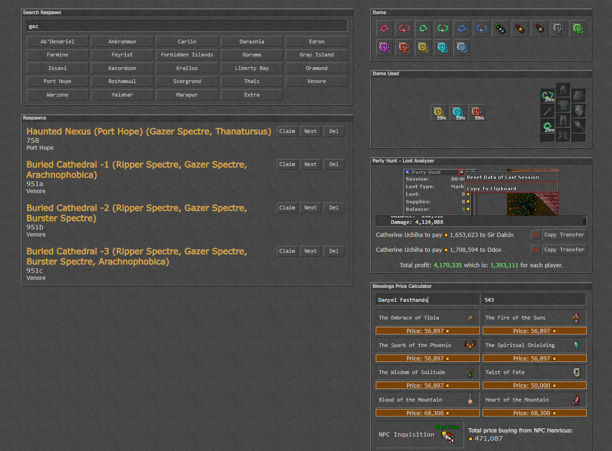

<p align="center">
  

  

  

  <a href="https://github.com/danyelvarejao/respawn-finder/commits/production">
    
  </a>

  <a href="https://github.com/danyelvarejao/respawn-finder/issues">
    
  </a>
</p>



## 💻 Projeto

Site com ferramentas que auxiliam o jogador de Tibia.

* Respawn Finder - Busca respawn pelo nome.
* Items Timer - Temporizador de items, envia uma notificação via som quando o item estiver prestes a acabar.
* Party Hunt - Calcula o quanto de (waste/profit) a hunt deu e o quanto cada jogador tem que pagar para os membros da party.
* Blessings Price Calculate - Calcula o preço da bless baseado no level do jogador.

## ⚙ Tecnologias
-  [AngularJS](https://angular.io/)
-  [Sass](https://sass-lang.com/)
-  [TypeScript](https://www.typescriptlang.org/)

Também foi adicionado a ferramenta [**ESLint**](https://eslint.org/) para aumentar a produtividade e auxiliar a manter um padrão de código.

## 📥 Instalação e execução

Faça um clone desse repositório e acesse o diretório.

```bash
# Instalando as dependências
$ yarn

# Executanto aplicação
$ yarn start
```
